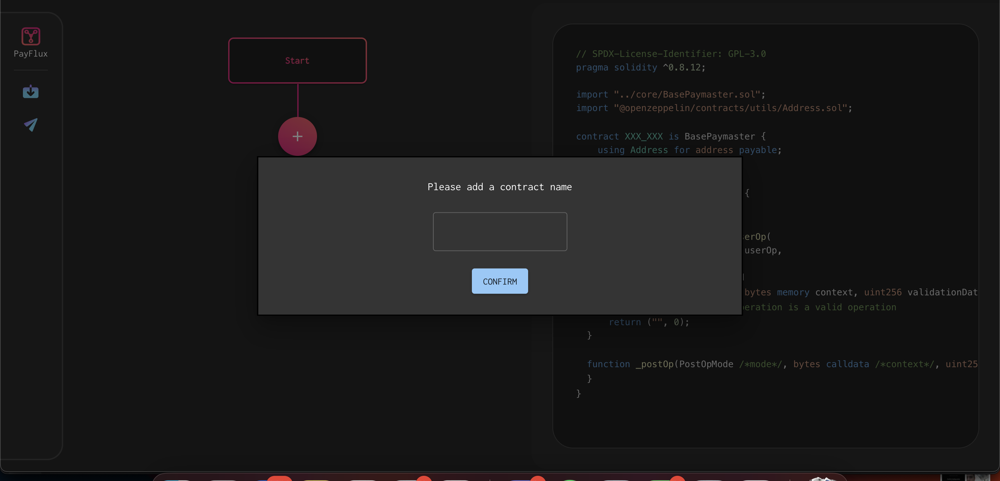
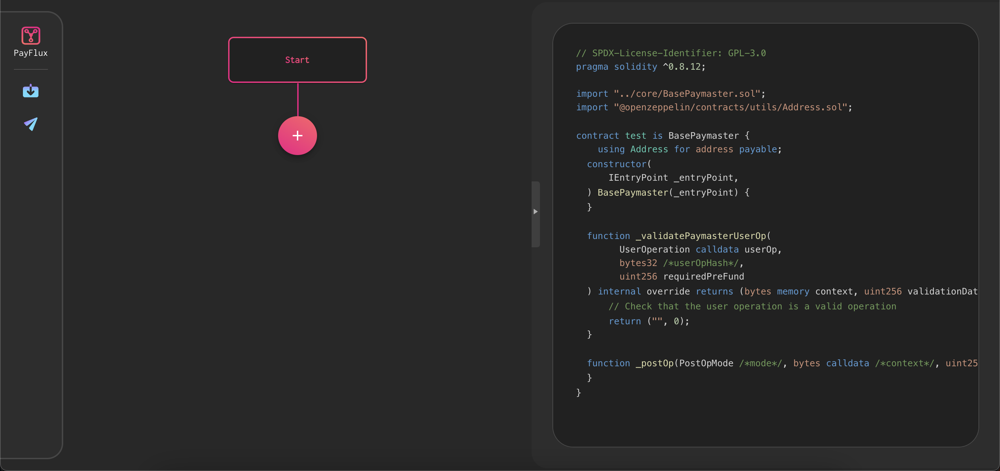
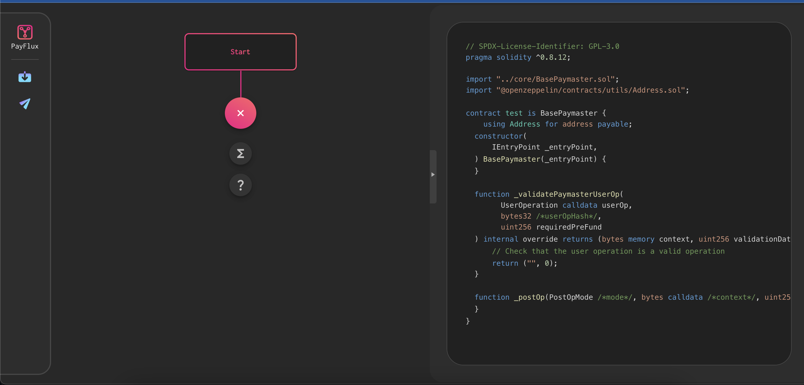
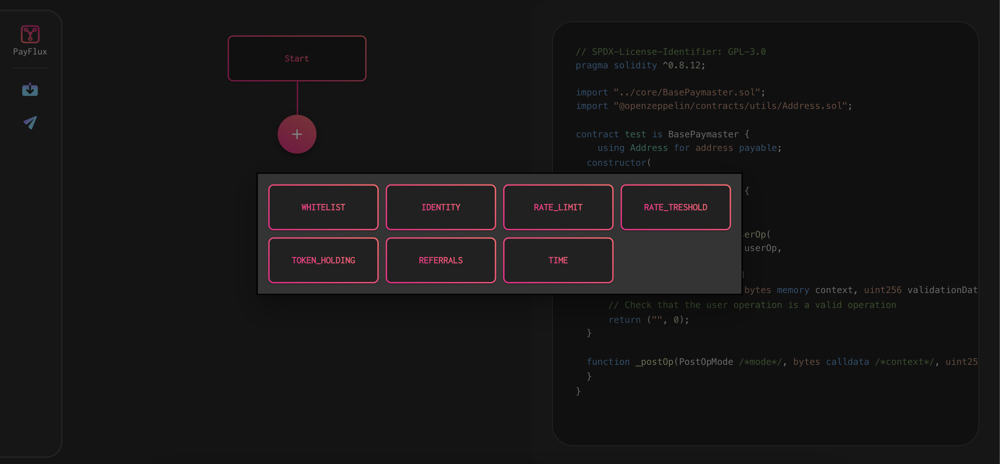
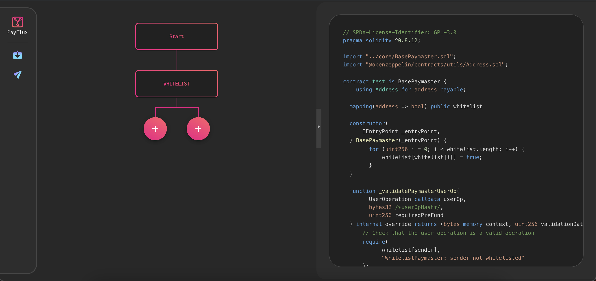
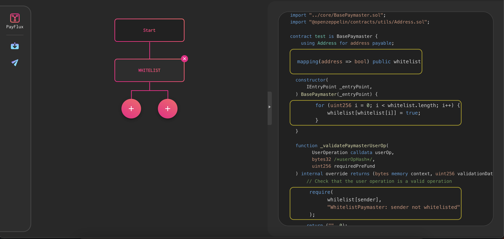
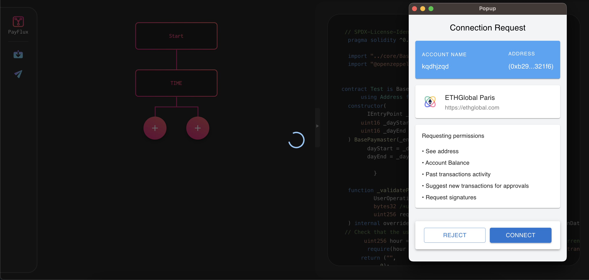

# PayFlux

Our solution offers a personalized gas payment strategy tailored for each business. With our dApp, businesses can define a specific group of users whose gas fees they are willing to cover. They can also define specific conditions for those groups.

Businesses can utilize verified identity protocols to ensure that they're compensating gas costs for genuine users only. They can also choose to pay for users who maintain an active subscription, or for users who have been invited through a referral system.

Additionally, the payment strategy could be designed based on transaction volume, specific times of the day, or to favor early adopters.

However, there are some limitations. When the existing transaction pool logic is integrated with Account Abstraction's (AA's) arbitrary transaction validity, a new type of attack on the Ethereum network becomes possible: a single transaction within a mined block can invalidate a significant number of previously valid pending transactions. In the event of a sustained attack, nodes could end up wasting considerable computational resources on validating, propagating, and eventually discarding these transactions. To mitigate this risk, the EIP introduces several transaction pool restrictions, thereby reducing the risk to a level similar to non-AA transactions.

## How to run locally?

```
yarn install
```

```
yarn start
```

## How to use the app?

- When you go to the app, you need to fill the contract name.


- Then you arrive to the main page


- You can add some blocks to customize the base template of the paymaster contract.


- You can click to conditions button and you can see a modal to select the condition


- You can click on one of them and see a new block added into the tree and the updated code. 


- If you hover a block, you can see the corresponding statement in the code


- You can click on "Send" button to deploy the smart contract


- Congrats! If you validate the transaction, your smart contract is deployed

- Moreover, if you click on the "Save the code", you can download the source code to deploy it by yourself.